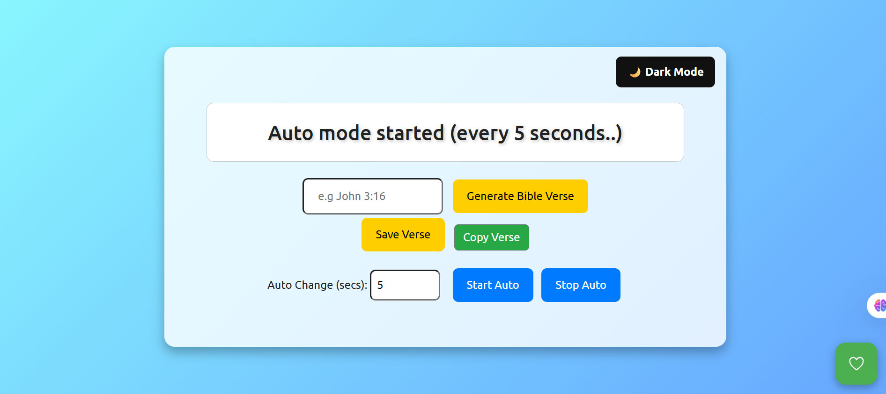
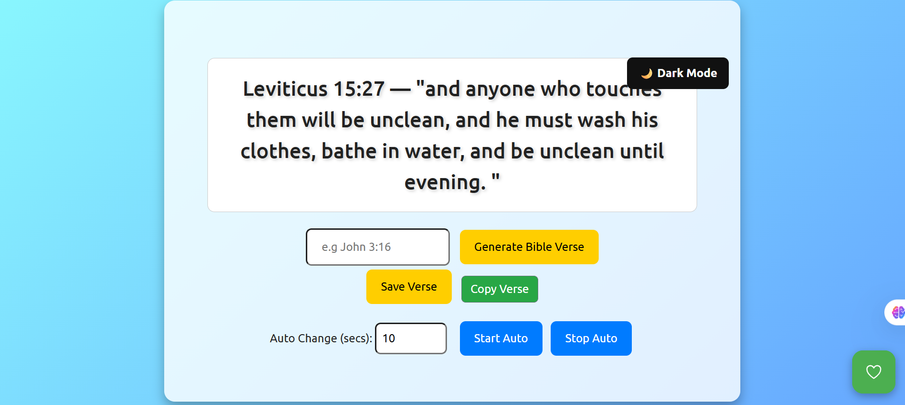
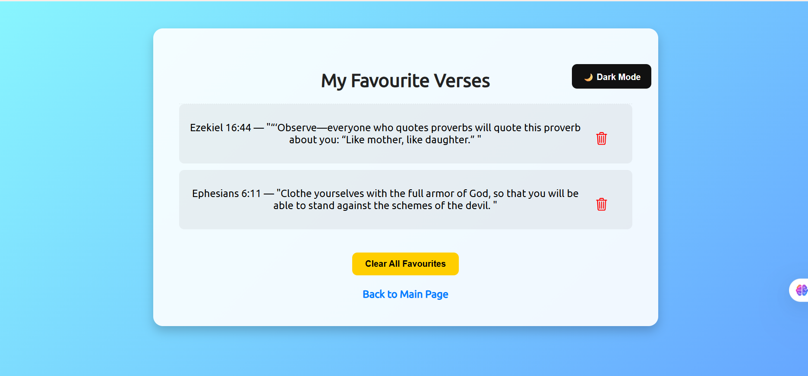

# 📖 Bible Verse Generator

A beautiful and interactive **Bible Verse Generator App** built with HTML, CSS, and JavaScript — designed to help users discover random Bible verses, save favourites, and meditate daily, all within a calm, responsive, and faith-inspired interface.

---

### ✝️ About This Project

> “Your word is a lamp to my feet and a light to my path.” — *Psalm 119:105*

This project was created to inspire daily connection with God’s Word.  
It’s more than just a Bible verse generator — it’s a reminder that no matter where you are, **God still speaks through His Word**.  
Whether you’re coding, studying, or just need encouragement, one verse can change your day.

---

## 🌟 Features

✅ **Random & Custom Verses** – Generate random verses or search by a specific passage (e.g., John 3:16).  
✅ **Auto Verse Mode** – Automatically changes verses every few seconds.  
✅ **Favourites System** – Save your favourite verses to revisit anytime.  
✅ **Dark Mode Toggle** – Switch between light and dark themes effortlessly.  
✅ **Copy to Clipboard** – Copy verses instantly with one click.  
✅ **Toast Notifications** – Subtle popup feedback for user actions.  
✅ **Responsive Design** – Works beautifully on desktop and mobile.

## 🖼️ Preview

### 🏠 Home Page/Default page
()

### 💡 Working Page

### Auto Mode function

### Favourites Page

## 🛠️ Tech Stack
- 🏗️ **HTML5** — Structure & content  
- 🎨 **CSS3 (Media Queries)** — Styling, responsiveness, and animations  
- ⚡ **JavaScript (ES6)** — Core logic and interactivity  
- 💜 **Bootstrap 5** — UI enhancements (tooltips, toasts, layout)  
- 🌐 **Axios** — Fetching verses from the [Bible.org API](https://labs.bible.org/api_web_service)  
- ✍️ **Google Fonts (Ubuntu)** — Elegant typography  
- 🔆 **Ionicons** — Modern, lightweight icons

## ⚙️ How It Works

1️⃣ Type a verse reference (like **John 3:16**) or leave it blank for a random verse.  
2️⃣ Click **Generate Bible Verse** to fetch and display a verse.  
3️⃣ Click **Save Verse** to store it in your local storage.  
4️⃣ Click **Copy Verse** to copy the current verse to your clipboard.  
5️⃣ Toggle **Dark Mode 🌙** for a comfortable reading experience.  
6️⃣ Use **Auto Mode** to refresh verses automatically at your chosen interval.

## 🧠 API Reference

Base URL:

https://labs.bible.org/api/?passage={passage}&type=json

Example:

https://labs.bible.org/api/?passage=John%203:16&type=json

## Local storage keys
| Key | Description |
| --- | ----------- |
| bibleVerseFavourites | Array of saved verse strings |

Stores an array of saved verses locally on your browser.

## 🚀 Live Demo

🔗  **View Project on GitHub Pages**  
👉 [https://ott-tech.github.io/bible-verse-generator/](https://ott-tech.github.io/bible-verse-generator/)

## ✨ Folder Structure
📦 Bible-Verse-Generator
 ┣ 📂 css
 ┃ ┗ 📜 styles.css
     📜 stylesfavourites.css
 ┣ 📂 js
 ┃ ┣ 📜 script.js
 ┃ ┗ 📜 favourites.js
 ┣ 📜 index.html
 ┣ 📜 favourites.html
 ┗ 📜 README.md

## 📜 License

This project is open-source and available under the MIT License.  
Feel free to use, modify, and share with proper attribution.

---

## 🧑‍💻 Quick Start

1️⃣ Clone or download the repo.  
2️⃣ Open the project folder in **VS Code**.  
3️⃣ Run **Live Server** or open `index.html` in your browser.

---

## 📜 License

🪪 **MIT License** — feel free to use, modify, and share this project with proper attribution.

---

## 🙏 Acknowledgments

- 📖 [Bible.org API](https://labs.bible.org/api_web_service)  
- 💜 [Bootstrap](https://getbootstrap.com/)  
- ⚡ [Ionicons](https://ionic.io/ionicons)  
- 🔤 [Google Fonts (Ubuntu)](https://fonts.google.com/specimen/Ubuntu)

---

## 👨‍💻 Author

**Made with ❤️ by [ott-tech](https://github.com/ott-tech)**  
👤 **Oluwaferanmi Akinkuehin**  
🔗 [LinkedIn](https://www.linkedin.com/in/oluwaferanmi-akinkuehin/) • [Instagram](https://www.instagram.com/oluwaferanmiotito.akinkuehin/)

---

### 💡 Purpose
> Built with ❤️ and faith — to spread light through code and remind the world that **God’s Word still speaks**.

---

